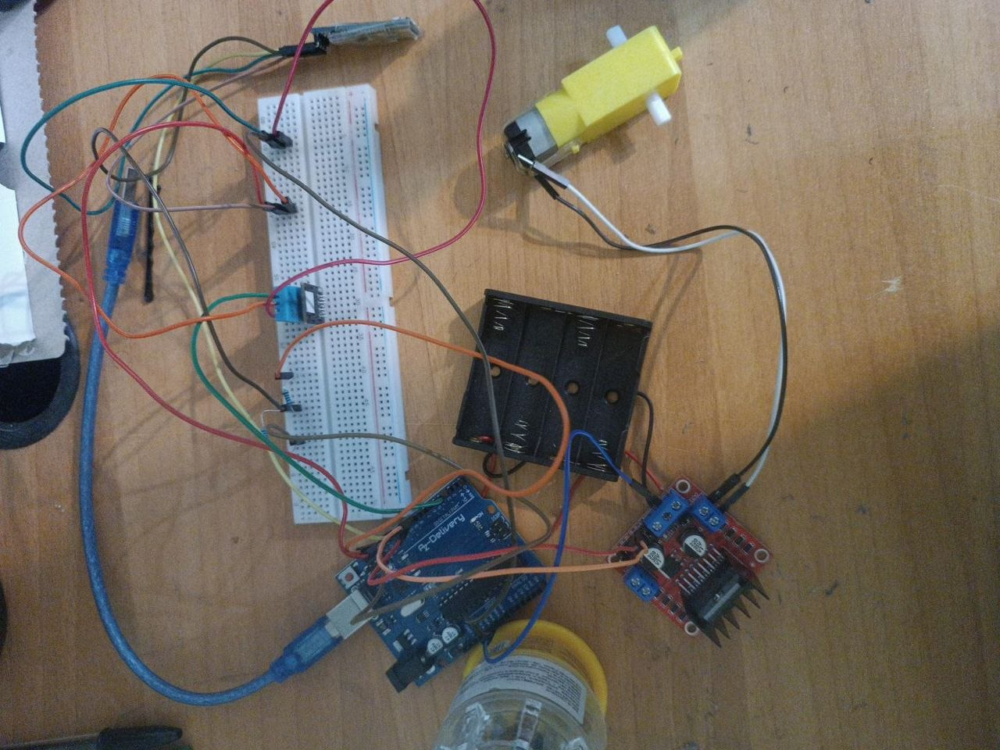

# Arduino Bluetooth Car with Temperature & Humidity Monitoring

An Arduino-based Bluetooth-controlled car integrating motor control and environmental monitoring.

## Project Overview

This project uses an Arduino Uno to control a DC motor through an L298N motor driver. An HC-06 Bluetooth module enables wireless control from a smartphone, while a DHT11 sensor measures temperature and humidity.

The system was built, programmed, and tested as a functional prototype.

## Features

- Bluetooth wireless control using HC-06
- Forward and backward motor control
- Motor stop command
- Temperature measurement using DHT11
- Humidity measurement using DHT11
- Temperature and humidity data transmitted via Bluetooth
- Approximately 10 m Bluetooth operating range during testing

## Hardware

- Arduino Uno
- HC-06 Bluetooth module
- L298N motor driver
- DC motor
- DHT11 temperature and humidity sensor
- Breadboard and jumper wires
- 1 kΩ and 2 kΩ resistors for the HC-06 RX voltage divider

## Pin Configuration

| Component | Arduino Pin |
|---|---|
| HC-06 RX/TX communication | D10 / D11 |
| L298N IN1 | D8 |
| L298N IN2 | D9 |
| DHT11 Signal | D2 |

## Bluetooth Commands

| Command | Function |
|---|---|
| F | Motor Forward |
| B | Motor Backward |
| S | Stop Motor |
| T | Read Temperature & Humidity |

## How It Works

The Arduino receives commands wirelessly from the HC-06 Bluetooth module.

When F or B is received, the Arduino changes the L298N control signals to determine the motor direction. The S command stops the motor.

When T is received, the Arduino reads temperature and humidity from the DHT11 sensor and sends the measurements back through Bluetooth.

## Technologies & Skills

Arduino • C/C++ • Embedded Systems • Sensors • Bluetooth Communication • Motor Control • Hardware Integration

## Source Code

The complete Arduino source code is available in DHT.ino.

## Author
## Hardware Prototype

Ali Izadi Jahromi
